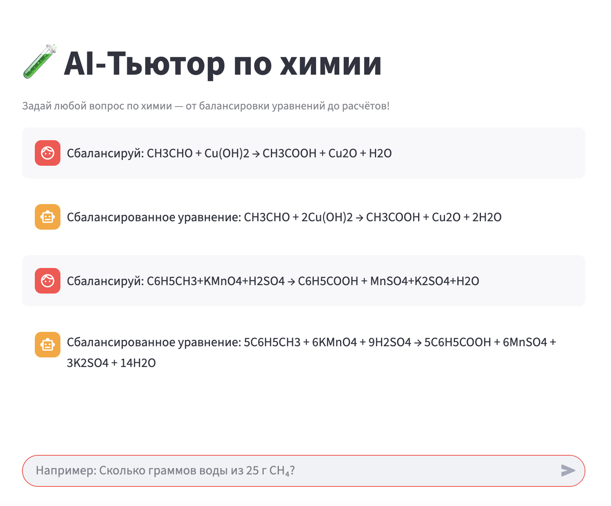
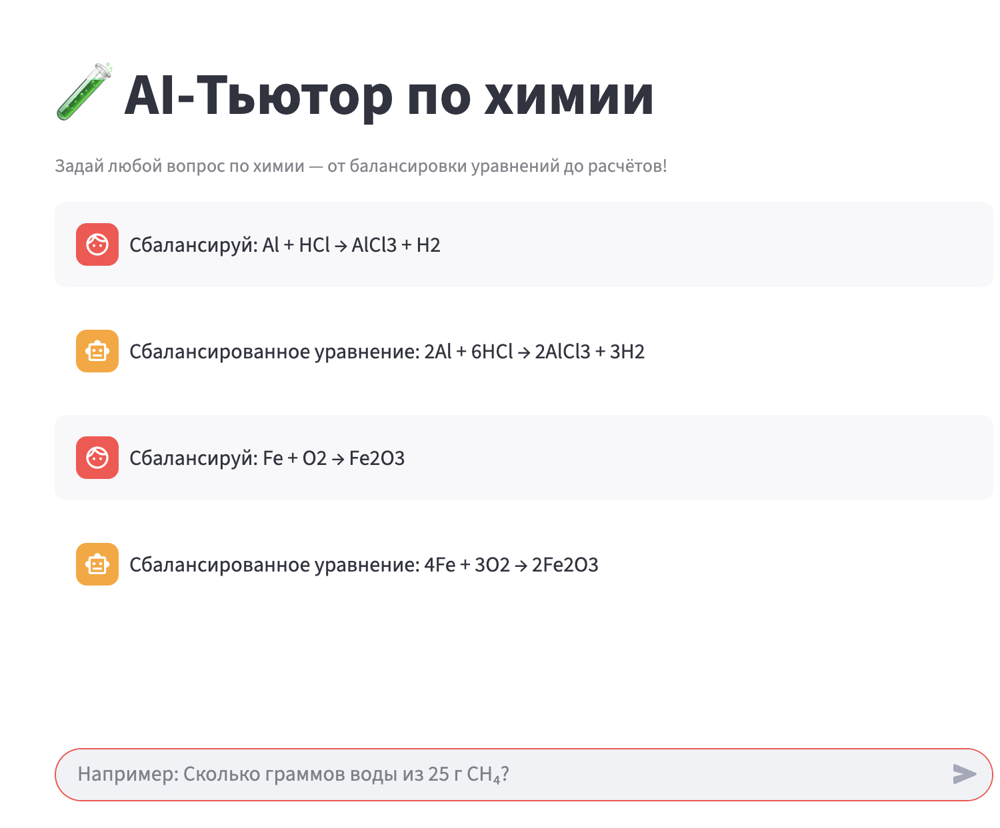
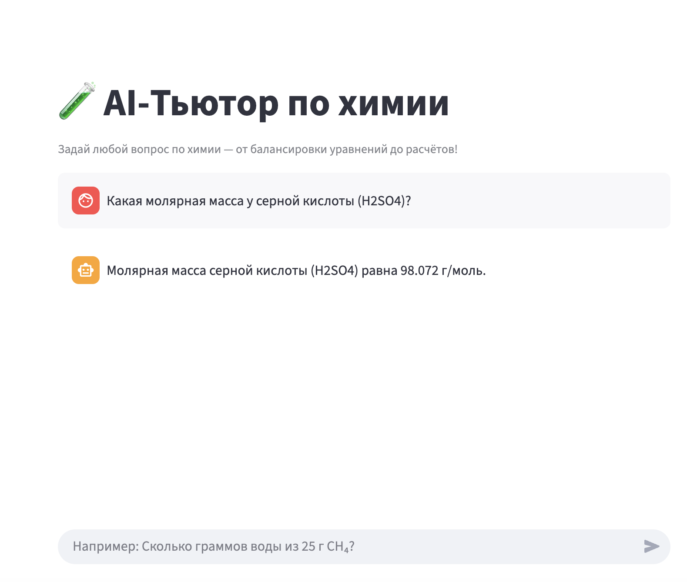
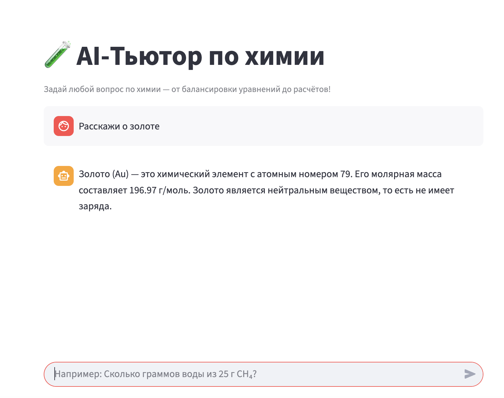

# Chemistry-Tutor

Интеллектуальный помощник на основе LLM, способный решать широкий спектр химических задач — от балансировки уравнений до многоэтапных стехиометрических расчётов. Система использует **ReAct-подход** (Reason + Act): LLM анализирует запрос, декомпозирует его на подзадачи и **самостоятельно выбирает нужные инструменты** для получения точных данных.

---

##  Архитектура решения

###  Инструменты (tools)
Все инструменты реализованы как **атомарные, специализированные функции**, что позволяет LLM гибко комбинировать их:

| Инструмент | Назначение | Библиотека |
|-----------|-----------|-----------|
| `balance_equation` | Балансировка химических уравнений | `chempy` |
| `calculate_molar_mass` | Расчёт молярной массы по формуле | `chempy` |
| `get_element_properties` | Свойства химических элементов (Au, Fe, O) | `mendeleev` |
| `get_ion_info` | Информация об ионах (MnO₄⁻, SO₄²⁻) | `pubchempy` |
| `get_compound_info` | Данные о нейтральных соединениях (H₂SO₄, глюкоза) | `pubchempy` |
| `predict_reaction_products` | Предсказание продуктов реакции по реагентам и контексту | **Few-shot prompting к той же LLM** |
| `execute_code` | Безопасное выполнение математических расчётов | `asteval` |

### 🤖 Как LLM принимает решение
1. **Анализ запроса**: LLM определяет тип задачи (балансировка, стехиометрия, свойства и т.д.).
2. **Декомпозиция**: сложные задачи (например, стехиометрия) разбиваются на шаги:
   - Определить реагенты → предсказать продукты → собрать уравнение → сбалансировать → найти молярные массы → выполнить расчёт.
3. **Выбор инструмента**: на каждом шаге LLM вызывает **ровно один** инструмент через строгий формат: Action: {"name": "tool_name", "args": {"param": "value"}}

4. **Цикл ReAct**: система повторяет цикл «Thought → Action → Observation», пока не получит финальный ответ.

> LLM **никогда не выдумывает** молярные массы, коэффициенты или продукты — всё запрашивается через инструменты.

---

## Примеры диалогов

### 1. Балансировка уравнения

---

### 2. Молярная масса

---

### 3. Стехиометрический расчёт
**Пользователь:**  
> Сколько граммов воды получится при сжигании 25 г метана (CH₄) в избытке кислорода?

**Система (внутренние шаги):**
1. Вызывает `predict_reaction_products(reactants="CH4,O2", context="сгорание")` → `"CO2 + H2O"`
2. Собирает уравнение: `CH4 + O2 -> CO2 + H2O`
3. Вызывает `balance_equation` → `"CH4 + 2O2 -> CO2 + 2H2O"`
4. Вызывает `calculate_molar_mass` для CH₄ и H₂O
5. Выполняет расчёт через `execute_code`
6. Возвращает:  
> При сжигании 25 г метана образуется **56.25 г воды**.

---

### 4. Свойства вещества

---

## Инструкции по локальному запуску

### Требования
- Python 3.9+
- Учётная запись [OpenRouter](https://openrouter.ai) (бесплатно)
- (Опционально) API-ключ от DeepInfra/Together для увеличения лимитов

### Установка
1. Клонируйте репозиторий
   
git clone https://github.com/import-Julik/Chemistry-Tutor.git

cd chemistry-tutor

3. Создайте виртуальное окружение
   
python -m venv venv

source venv/bin/activate  # Linux/macOS

или venv\Scripts\activate  # Windows

5. Установите зависимости

pip install -r requirements.txt

7. Настройте переменные окружения

cp .env.example .env

Откройте .env и вставьте свой OPENROUTER_API_KEY

### Запуск

Запустите веб-интерфейс
streamlit run app.py

### Публичная ссылка 

Поскольку сервис ngrok недоступен для пользователей из России из-за географических ограничений, в качестве альтернативы используется отечественный сервис CloudPub — российская замена ngrok, обеспечивающая стабильный доступ к локальным приложениям.
Пример публичной ссылки: https://chemistry-tutor.cloudpub.ru/
(ссылка активна во время работы туннеля; для постоянного доступа требуется запуск клиента CloudPub на машине с запущенным Streamlit-сервером). 

## Идеи для дальнейшего развития (архитектурный фокус)
1. Модульная система типов реакций

Заменить few-shot prompting в predict_reaction_products на плагинную архитектуру: каждый тип реакции (сгорание, гидролиз, ОВР) — отдельный модуль с правилами и валидацией.

2. Кэширующий промежуточный слой

Ввести единый химический кэш (например, на основе diskcache), чтобы избежать повторных вызовов PubChem/mendeleev для одних и тех же веществ.

3. Валидация выхода инструментов

Добавить пост-обработку результатов: например, проверять, что коэффициенты в уравнении — целые числа, а молярная масса > 0.

4. Поддержка многошаговых пользовательских сессий

Расширить ReAct-цикл до многосессионного режима: пользователь может задавать уточняющие вопросы в рамках одной задачи («А если кислорода не хватает?»).

5. Интеграция с химическими онтологиями

Использовать базы вроде ChEBI или Wikidata для семантического разрешения неоднозначностей («вода» → H₂O, а не H₂O₂).

6. Адаптивный выбор модели

Для простых задач (молярная масса) использовать лёгкие модели (Gemma-2B), для сложных (стехиометрия) — мощные (Qwen, Llama-3-70B), снижая стоимость и задержку.
